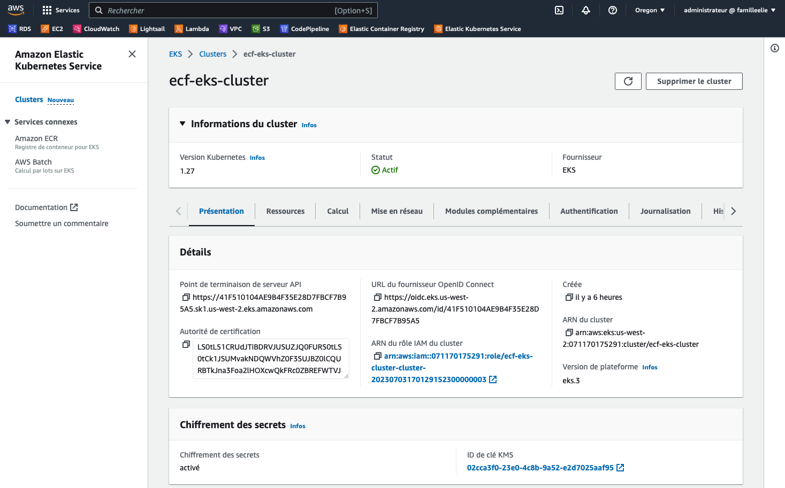
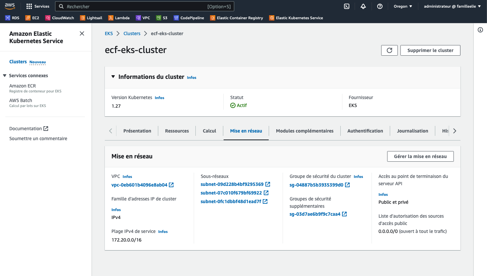

### Github repository : ecf_eks_terraform.

---
### Inspired from various readed exemples :
- VPS module : https://registry.terraform.io/modules/terraform-aws-modules/vpc/aws/latest
- EKS module : https://registry.terraform.io/modules/terraform-aws-modules/eks/aws/latest
- ESK How to : https://developer.hashicorp.com/terraform/tutorials/kubernetes/eks


# Activité Type 1 : Automatisation du déploiement d’infrastructure dans le Cloud

Included task :

1. Préparez un kube kubernetes en utilisant Terraform.


## Introduction :
<p>Configuration in this directory creates with Terraform an AWS EKS cluster with various features needed to habe a worked cluster described below.</p>

### What I done :

<p>
In the Terraform's main.tf I called two modules :

1. : VPC (Virtual Private Cloud)<br><br>
First, the EKS cluster needs to have a VPC declared, private and public subnets for nodes and a iPv4 CIDR adress blok.<br><br>

1. : EKS<br><br>
Let's create the EKS cluster! This is definition list needs by the Terraform's eks module :<br>
- VPC and subnet ids refered to the vpc module created in the last step.
- Cluster name and Kubernetes version
- If the cluster will have a public acces
- The desired node groups are listed in the EKS managed-mode-groups section. Each group is specifyed a name, the AMI instance type (t4g.small), min-max-desired size of nodes.

**Warning**
>managed-mode-groups had a processos architecture type attribute like x86_64 for runing Amazon Machine Image on nodes. I use ami_type = "AL2_ARM_64" in the script because I builded Docker image on a ARM processor.
 
<br>


Make sûr to have terraform and aws cli command line tools installed and configured on your machine. Then, you can use the Terraform's main.tf file by :

Usage :
```
terraform init
terraform plan # For prevew what will do
terraform apply
```

# Screenshots

End of Terraform's output. The cluster is created successfully.<br>
Wee can see the outputs defined in the outputs.tf like the endpoint, name or the cluster region.


Go to the ESK AWS console to check the presence of the cluster.


Cluster overview.


Wee can see the tree nodes as wanted.


Detailed nodes informations.


Network information as cluster's VPS, subnet, security groups...
